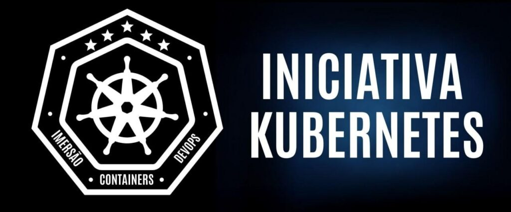

# Conversao-peso <small style="font-size:10px">by Allyson04</small>

## Fork de Conversao-peso <small style="font-size:10px">by Fabricioveronez</small>

Este repositório é fork do desafio 2 do evento "Iniciativa Kubernets", com o objetivo de treinar a criação de imagens e containers Docker.

Foi criado o arquivo dockerfile do zero, analisando quais são as tecnologias necessarias para o container rodar corretamente o serviço. Desta vez, foi trabalhado multi-stage builder, para executar varios containers. Além deste repositório do GitHub, também foi enviado a imagem para o dockerhub.io, o link para acesso por lá é [https://hub.docker.com/repository/docker/allyson04/conversao-peso](https://hub.docker.com/repository/docker/allyson04/conversao-peso).

Este repositório usa tecnologias `.NET`, `dockerfile` e `npm`.

Para sugestões ou qualquer outra necessidade de contato, me chama no [Linkedin](https://www.linkedin.com/in/allyson04/).
